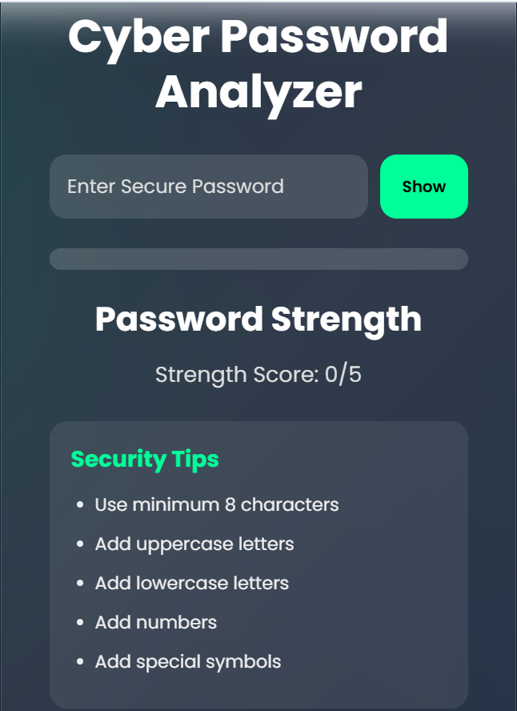

# CyberPass Analyzer

CyberPass Analyzer is a modern password strength analyzer web application developed using HTML, CSS, and JavaScript.

It helps users evaluate password strength using cybersecurity-based validation techniques such as:
- Uppercase detection
- Lowercase detection
- Numeric validation
- Special character validation
- Password strength scoring

## Features

- Real-time password strength checking
- Weak / Medium / Strong detection
- Animated strength bar
- Show / Hide password option
- Modern cybersecurity UI
- Responsive design

## Technologies Used

- HTML
- CSS
- JavaScript

## Cybersecurity Concepts Used

- Password Security
- Authentication Security
- Password Policy Enforcement
- Brute Force Protection Awareness
- Input Validation

## Project Screenshot

## Author

Akash Sawade
